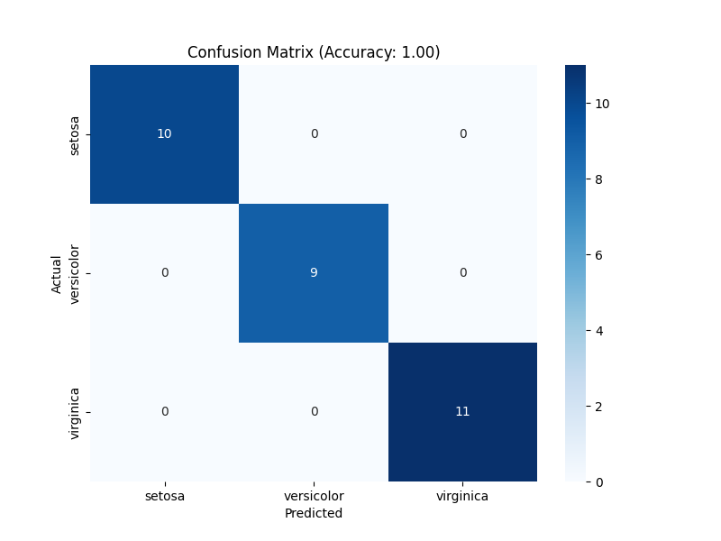
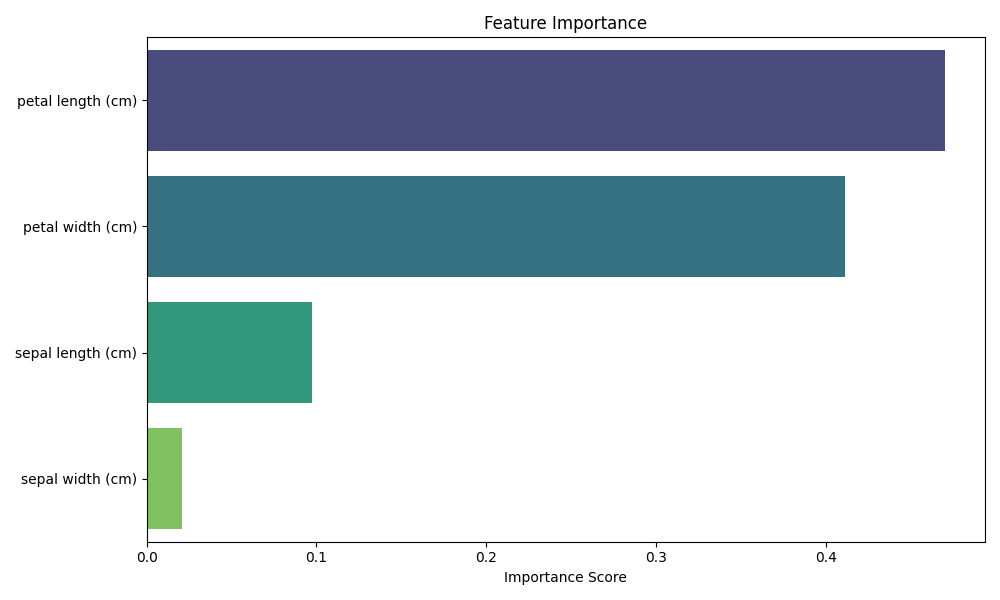

# Iris Flower Classification

##  Task Objective
Develop a machine learning model to classify Iris flowers into three species (*setosa*, *versicolor*, *virginica*) based on sepal and petal measurements. Identify the most significant features influencing the classification.

##  Dataset
**Source**: Built-in Scikit-learn Iris dataset.  
**Features**:  
- Sepal length (cm)  
- Sepal width (cm)  
- Petal length (cm)  
- Petal width (cm)  
**Target**: Species (`setosa`, `versicolor`, `virginica`).

##  Quick Start
### 1. Clone the Repository
git clone https://github.com/yourusername/iris-classification.git
cd iris-classification

2. Install Dependencies
pip install -r requirements.txt

3. Run the Code
python main.py

📊 Results
Accuracy: >95%.

Key Features: Petal length and width are most significant.

Sample Output:

Accuracy: 1.0
Classification Report:
              precision  recall  f1-score   support
    setosa         1.00      1.00      1.00        10
versicolor         1.00      1.00      1.00         9
 virginica         1.00      1.00      1.00        11

 Visualizations
1:Confusion Matrix:

2:Feature Importance:
